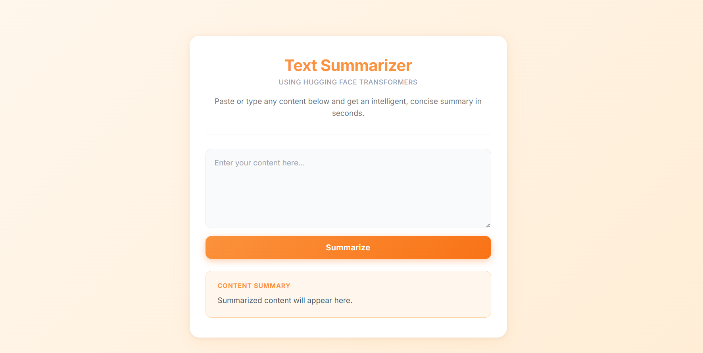
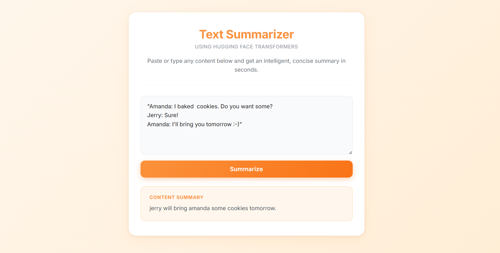

# 📝 Text Summarizer App

An AI-powered text summarization web application built with **FastAPI** and **Hugging Face Transformers**. Paste any dialogue or content and receive an intelligent, concise summary in seconds — powered by a fine-tuned **T5** model.

---

## 🚀 Features

- 🤖 **AI-Powered Summarization** — Fine-tuned T5 transformer model for high-quality dialogue summarization
- ⚡ **FastAPI Backend** — Async REST API with automatic docs at `/docs`
- 🎨 **Responsive Web UI** — Clean, modern interface built with vanilla HTML, CSS & JavaScript
- 🖥️ **GPU / CPU Support** — Automatically detects and uses CUDA GPU if available, falls back to CPU
- 🧹 **Text Preprocessing** — Cleans HTML tags, extra whitespace and line breaks before inference
- 📦 **Local Model** — Model weights are saved locally — no external API calls at inference time

---

## 📸 Screenshots

### App UI






| View | Description |
|------|-------------|
| 🖥️ Main UI | Text input form with orange-themed design |
| ✅ Output | AI-generated summary displayed below the form |

---

## 🗂️ Project Structure

```
Text_summarizer-App/
│
├── app.py                   # FastAPI application & inference logic
├── index.html               # Frontend UI (served via Jinja2 templates)
│
├── Notebooks/
│   └── Text_Summarizer.ipynb  # Model training & experimentation notebook
│
├── Datasets/
│   ├── samsum-train.csv       # Training split (SAMSum dataset)
│   ├── samsum-validation.csv  # Validation split
│   └── samsum-test.csv        # Test split
│
├── saved_summary_model/       # ⚠️ NOT included in repo (see note below)
│   ├── config.json
│   ├── generation_config.json
│   ├── model.safetensors      # ~231 MB — exceeds GitHub file size limit
│   ├── tokenizer.json
│   └── tokenizer_config.json
│
├── requirements.txt           # Project dependencies
└── .gitignore
```

> [!WARNING]
> **Model files are not included due to GitHub file size limitations.**
> The `saved_summary_model/` directory (especially `model.safetensors` at ~231 MB) exceeds GitHub's 100 MB file size limit and is excluded via `.gitignore`.
> To use this project, train the model yourself using `Notebooks/Text_Summarizer.ipynb`, or download it from a model hosting service (e.g., [Hugging Face Hub](https://huggingface.co/)).

---

## 🛠️ Tech Stack

| Layer        | Technology                          |
|--------------|-------------------------------------|
| Backend      | FastAPI, Uvicorn, Starlette         |
| ML / NLP     | Hugging Face Transformers, PyTorch  |
| Model        | T5 (fine-tuned on SAMSum dataset)   |
| Tokenizer    | T5Tokenizer (Hugging Face)          |
| Frontend     | HTML5, CSS3, Vanilla JavaScript     |
| Templating   | Jinja2                              |
| Data         | SAMSum Dialogue Summarization Dataset |

---

## ⚙️ Installation & Setup

### 1. Clone the Repository

```bash
git clone https://github.com/your-username/Text_summarizer-App.git
cd Text_summarizer-App
```

### 2. Create & Activate a Virtual Environment (Recommended)

```bash
python -m venv venv

# Windows
venv\Scripts\activate

# macOS / Linux
source venv/bin/activate
```

### 3. Install Core Dependencies

> **Note:** The `requirements.txt` reflects a full Anaconda environment. For a clean install, use only the packages below:

```bash
pip install fastapi uvicorn transformers torch pydantic jinja2
```

Or install from the full requirements file:

```bash
pip install -r requirements.txt
```

### 4. Ensure the Model is Present

The fine-tuned model should exist in the `saved_summary_model/` directory. If it's missing, train it first using the notebook at `Notebooks/Text_Summarizer.ipynb`.

---

## ▶️ Running the App

Start the FastAPI development server with:

```bash
uvicorn app:app --reload
```

Then open your browser and navigate to:

```
http://127.0.0.1:8000
```

> **API Docs** are automatically available at `http://127.0.0.1:8000/docs`

---

## 🔌 API Endpoints

### `GET /`
Serves the main web UI.

### `POST /summarize`
Summarizes a given piece of dialogue text.

**Request Body:**
```json
{
  "dialogue": "Your text content here..."
}
```

**Response:**
```json
{
  "summary": "A concise AI-generated summary."
}
```

---

## 🧠 Model Details

| Property         | Value                             |
|------------------|-----------------------------------|
| Architecture     | T5 (Text-to-Text Transfer Transformer) |
| Dataset          | SAMSum (dialogue summarization)   |
| Max Input Length | 512 tokens                        |
| Max Output Length | 150 tokens                       |
| Decoding Strategy | Beam Search (num_beams=4)        |
| Format           | Saved as `model.safetensors`      |
| Repo Availability | ⚠️ Not pushed to GitHub (file size limit) |

> [!IMPORTANT]
> **Model files are not included in this repository** due to GitHub's 100 MB file size restriction.
> You must either train the model locally via the Jupyter notebook or host it on [Hugging Face Hub](https://huggingface.co/) and load it remotely.

---

## 📓 Training Notebook

The `Notebooks/Text_Summarizer.ipynb` notebook covers:

- Dataset loading and preprocessing
- T5 model fine-tuning on the SAMSum dataset
- Evaluation metrics
- Saving the trained model to `saved_summary_model/`

---

## 📋 Requirements

Key dependencies used in this project:

- `fastapi==0.136.1`
- `uvicorn==0.47.0`
- `transformers==5.5.2`
- `torch==2.11.0`
- `pydantic`
- `starlette==1.0.0`
- `tokenizers==0.22.2`
- `safetensors==0.7.0`

---

## 👤 Author

**Ishika Bharadwaj**
- GitHub: [@https://github.com/ishikadubey792](https://github.com/ishikadubey792)

---

> Built with ❤️ using FastAPI & Hugging Face Transformers
